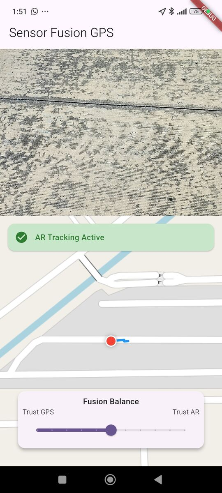

# Flutter GPS AR Fusion App


A Flutter application designed to achieve centimeter-level relative precision and trajectory smoothness by fusing **GNSS (Global Navigation Satellite System)** data with **Visual Inertial Odometry (VIO)** from Google ARCore and **Magnetic Heading**

This project uses a custom Kalman Filter to bridge the gap between slow, noisy satellite updates with high-frequency visual tracking data. This results in a **jitter-free** and **continuous path**.

The application visualizes this "jitter-free" path on an interactive map.

This project now includes **Google ARCore Geospatial API** integration, allowing for global localization (VPS) to correct drift using Google Street View data.


## 📷 Screenshots


## 🚀 Features

* **Sensor Fusion:** Combines three distinct data sources:
    * **GPS:** Absolute Position (Lat/Lon).
    * **ARCore:** Precise relative distance (Visual Odometry).
    * **Magnetometer:** Real-time True North heading
    * **VPS:**  High-precision global localization.

* **Geospatial Alignment (VPS):**
    * **Refine Location:** One-click check to localize against Google Earth data.
    * **Drift Correction:** Instantly snaps the user's location to the correct spot with <1m accuracy if visual features are available.

* **Real-time Tuning:** Includes a **"Fusion Balance" slider** to dynamically adjust the Kalman Filter's trust:
    * **Trust GPS:** Rely more on satellite data (fixes drift, but adds jitter).
    * **Trust AR:** Rely more on visual odometry (smooth path, but susceptible to drift).

* **Interactive Map Visualization:** Uses `flutter_map` (OpenStreetMap) to draw the user's path in real-time.
    * **Blue Line:** Represents the smooth, fused trajectory.
    * **Red Marker:** Represents the current estimated position.

* **Custom Kalman Filter:** Implements a 4-state Kalman filter (Latitude, Longitude, Velocity North, Velocity East) to merge data sources intelligently.

* **Native ARCore Integration:** Uses a custom Android Platform View (`ArCoreView`) enabling `GeospatialMode` for advanced tracking.

* **Real-time Dashboard:** Displays raw GPS data, AR relative displacement, and the final fused coordinates side-by-side.

* **Permissions Handling:** Manages run-time requests for Camera (AR) and Location (Fine/Coarse) permissions.

## 🛠 Architecture

The app operates using a Predict-Update cycle:

1.  **Prediction (High Frequency):**
    * **Distance:** The native Android layer captures camera motion (`TrackingState` and `Pose`) and sends the relative delta to Flutter.
    * **Direction:** `flutter_compass` provides the device's absolute bearing (True North).
    * **Logic:** The Kalman Filter projects the AR distance along the Compass heading to predict the new coordinate.

2. **Update (Lower Frequency):**
    * **GPS:** The `geolocator` plugin provides absolute GPS coordinates to correct the predicted state.
    * **VPS (On Demand):** The user triggers a "Refine" action. The app queries the ARCore Geospatial API. If the camera recognizes the surroundings (via Street View), the Kalman Filter is hard-reset to this high-accuracy position.

## 📦 Tech Stack
* **Frontend:** Flutter (Dart)
* **Native Module:** Kotlin (Android)
* **AR Engine:** Google ARCore SDK (via `GLSurfaceView` and custom Renderer and Geospatial API enabled)
* **Mapping:** `flutter_map` & `latlong2`
* **Sensors:** `flutter_compass` (Magnetometer), `geolocator` (GNSS)
* **Math:** `vector_math_64`

## 📋 Prerequisites
* **Hardware:** An Android device that supports **Google ARCore** (Google Play Services for AR).
* **OS:** Android 7.0 (Nougat) or later.
* **Environment:** Flutter SDK installed.

Note: This project currently supports **Android only**. The iOS implementation is a placeholder stub,

## ⚙️ Installation

1. **Clone the repository:**
   ```bash
    git clone https://github.com/IoT-gamer/flutter_gps_ar_fusion_app.git
    cd flutter_gps_ar_fusion_app
   ```

2. **Configure API Key:**

    * Required for VPS functionality option.

    * [Add your Google Cloud API Key with ARCore API enabled](https://developers.google.com/ar/develop/java/geospatial/enable#enable_the_arcore_api) to your `AndroidManifest.xml`.
    * for testing, you can add it directly inside the `<application>` tag: 
    ```xml
    <meta-data
    android:name="com.google.android.ar.API_KEY"
    android:value="your key here" />
    ```
    * Or follow other secure methods to store API keys.

3. **Install dependencies:**
    ```bash
    flutter pub get
    ```
4. **Run on a physical device:**
    * Connect your ARCore-supported Android device via USB.
    * Ensure "Developer Options" and "USB Debugging" are enabled.
    ```bash
    flutter run
    ```

## 📱 Usage

1. **Grant Permissions:** Accept Camera (AR), Location, and Internet permissions.

2. **Initialization:** Wait for a GPS fix to initialize the map center.
    
3. **Tracking:** Walk normally. The path will be smooth (AR) but geographically approximate (GPS).

4. **Refine (VPS):** If you notice the map path is offset from reality, press the **Refine/Explore** button.

5.  **Tuning:** Use the slider at the bottom of the screen:
    * **Slide Left (Trust GPS):** Use this if the blue line is drifting through buildings. The path will snap to the raw GPS points.
    * **Slide Right (Trust AR):** Use this if the GPS is jittering wildly. The path will become very smooth but may drift over long distances.

## 📂 Project Structure

```
lib/
├── main.dart                 # Main Flutter UI, Kalman Filter logic, and MethodChannel handling
android/
├── app/src/main/kotlin/com/example/flutter_gps_ar_fusion_app/
    ├── MainActivity.kt       # Registers the Native View Factory
    ├── ArCoreView.kt         # The PlatformView wrapper
    ├── ArCoreViewFactory.kt  # Factory for creating the view
    ├── MyArRenderer.kt       # Handles AR session, camera frame updates, and pose extraction
    └── BackgroundRenderer.kt # Renders the camera feed to the GLSurface
```

## ⚠️ Known Limitations

* **VPS Availability:** VPS only works in areas covered by Google Street View. Indoor support is limited.
* **Data Usage:** Checking VPS availability consumes mobile data.
* **Quota & Cost:** The Geospatial API has free tier limits. Exceeding these may incur costs or limit usage. Monitor your usage in the Google Cloud Console.
* **Magnetic Interference:** The compass can be affected by large metal objects (cars, steel beams), causing the path to temporarily skew.
* **Behavior:** VPS works best when the user points the camera at buildings or distinct skylines, whereas VIO tracking works best looking at the ground.

## 🤝 Contributing
Contributions are welcome! Please feel free to submit a Pull Request.

## 📜 License
This project is licensed under the MIT License - see the [LICENSE](LICENSE) file for details